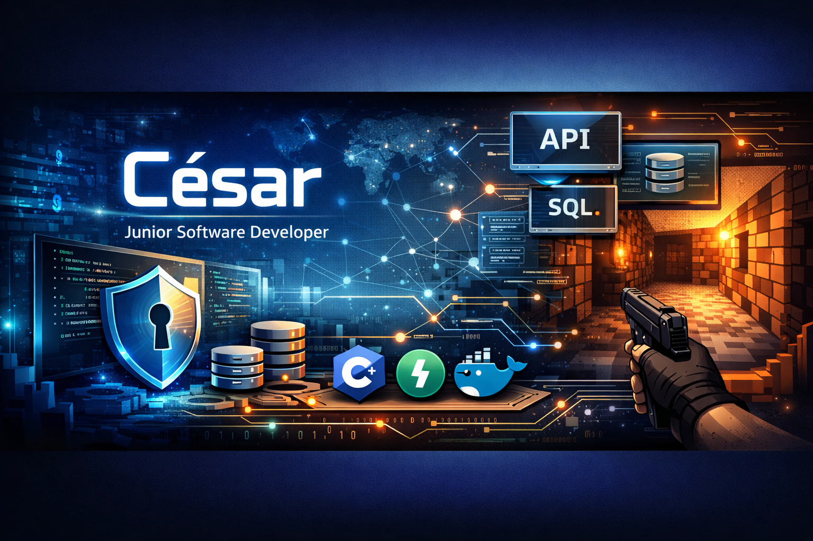

## Hi, I’m César 👋

**Junior Software Developer** focused on **backend systems, security, and low-level programming**.  
Hive Helsinki (42 Network) graduate with hands-on experience in authentication, networking,
systems programming, and real-time graphics.

### 🔎 About
- Built secure authentication flows with **JWT**, **2FA**, and **Google Authenticator**
- Developed networking systems, including a **non-blocking IRC server** in C++98
- Implemented system-level tooling: **Unix shell**, **memory management**, and process handling
- Built a **raycasting engine** and real-time gameplay components in C

### 🧰 Tech Stack
- **Languages:** C, C++, Python
- **Backend:** FastAPI, PostgreSQL, JWT, Docker
- **Systems:** Linux, sockets, `poll`, processes
- **Tooling:** Git, Makefile

### 📌 Featured Projects
- **42-ft_transcendence** — Multiplayer backend with secure JWT authentication and 2FA  
  Repo: https://github.com/Nebtakhet/42-ft_transcendence
- **ft_irc** — Non-blocking IRC server in C++98 using poll() and TCP sockets  
  Repo: https://github.com/Nebtakhet/ft_irc
- **42-Cub3d** — Raycasting game engine in C  
  Repo: https://github.com/Nebtakhet/42-Cub3d
- **minishell** — Unix-style shell implementation  
  Repo: https://github.com/Nebtakhet/42-minishell

### 🎯 Open To
Junior roles in **backend development**, **systems programming**, or **game programming**,
with teams that value clean code, reliability, and real-world problem solving.

### 📫 Contact
- LinkedIn: https://www.linkedin.com/in/nebtakhet  
- GitHub: https://github.com/Nebtakhet
