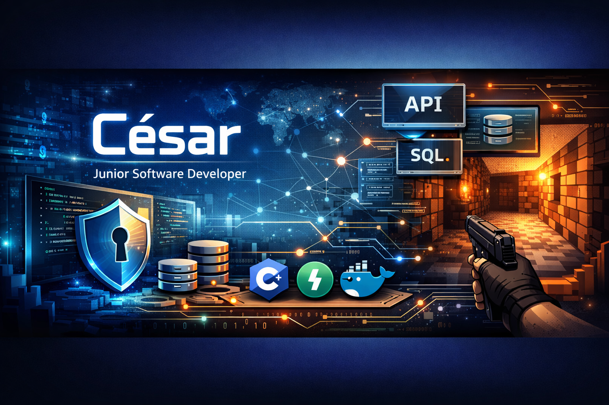

// 

## Hi, I’m César 👋

**Junior Software Developer** with a strong foundation in **systems programming, backend development, and real-time applications**.  
Graduate of **Hive Helsinki (42 Network)** with hands-on experience building networking services, backend APIs, and interactive graphics systems from scratch.

I enjoy working close to the fundamentals of software — **memory, concurrency, networking, and real-time logic** — while also exploring higher-level systems like backend services and gameplay mechanics.

---

## 🔎 About

- Built a **raycasting engine in C** with player movement, collision, and real-time rendering
- Developed a **2D endless runner** using **C++ and SFML**
- Implemented a **non-blocking IRC server** in C++98 using sockets and `poll`
- Built secure backend systems with **JWT authentication, 2FA, and Docker**
- Strong experience with **Linux, memory management, processes, and networking**

---

## 🧰 Tech Stack

**Languages**  
C • C++ • Python • C# (learning)

**Backend**  
FastAPI • PostgreSQL • JWT • Docker

**Systems Programming**  
Linux • Sockets • `poll` • Processes • Memory management

**Graphics / Game Development**  
SFML • Raycasting • Game loops • Collision systems

**Tools**  
Git • Makefile • VS Code

---

## 📌 Featured Projects

### Cub3D — Raycasting Engine (C)
A small game engine inspired by early 3D graphics techniques.

- Implemented raycasting rendering
- Player movement and collision detection
- Real-time game loop and texture rendering

Repo: https://github.com/Nebtakhet/42-Cub3d

---

### Endless Runner — C++ / SFML
Gameplay programming challenge originally built for a Supercell application.

- Implemented player movement and collision systems
- Added enemies, bosses, and gameplay logic
- Debugged and extended an existing codebase

Repo: https://github.com/Nebtakhet/sfml-endless-runner

---

### ft_irc — IRC Server (C++98)
Event-driven IRC server using TCP sockets and `poll()`.

- Non-blocking networking architecture
- Concurrent client handling
- IRC protocol parsing

Repo: https://github.com/Nebtakhet/ft_irc

---

### Backend Starter API
Production-style backend API built with FastAPI.

- JWT authentication and refresh tokens
- PostgreSQL database
- Dockerized deployment

Repo: https://github.com/Nebtakhet/backend-starter-api

---

## 🎯 Interests

- Systems programming
- Networking and backend systems
- Interactive graphics and gameplay mechanics
- Real-time applications

Background in **screenwriting and filmmaking**, which influences my interest in building engaging interactive systems and user experiences.

---

## 📫 Contact

LinkedIn  
https://www.linkedin.com/in/nebtakhet  

GitHub  
https://github.com/Nebtakhet
